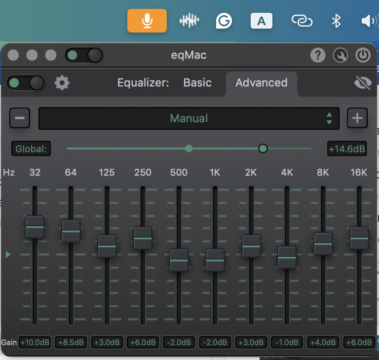
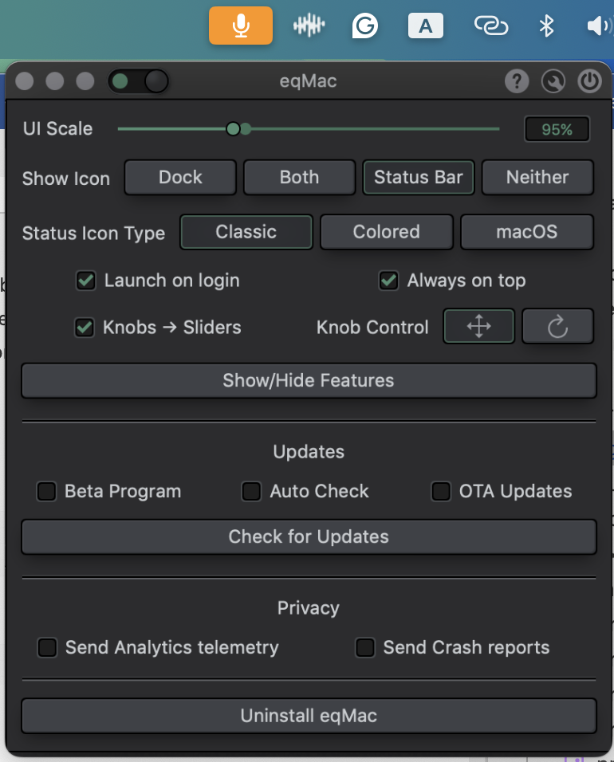

# eqMac Light 🎵

[简体中文](README_CN.md)

eqMac Light is a lightweight, clean, and distraction-free build of eqMac for macOS.

This project focuses on keeping the essential audio equalizer features while providing a completely offline, local-only interface experience.

### 🌟 Key Changes in this Build
* **Pure Audio Equalizing:** Focused on core audio control (Basic EQ) without any popups, premium registration menus, or subscription alerts.
* **Offline UI Execution:** We modified the application UI loader to fetch all interface elements locally from the app bundle. No remote server checks, trackers, or OTA updates.
* **Stable Route Control:** Disabled the automatic headphone detection/routing switches so your output device selection remains completely stable.
* **macOS Sequoia Compatibility:** Signed using a personal developer certificate, solving library validation constraints inside system audio processes.

### 📸 Screenshots

  
  &nbsp;&nbsp;
  

### 📥 Download
You can download the pre-compiled application bundle (`eqMac.app`) directly from the [Releases](https://github.com/howtoexitvim/eqmac-light/releases) page. Drag it to your `/Applications` directory, and you are ready to go!
